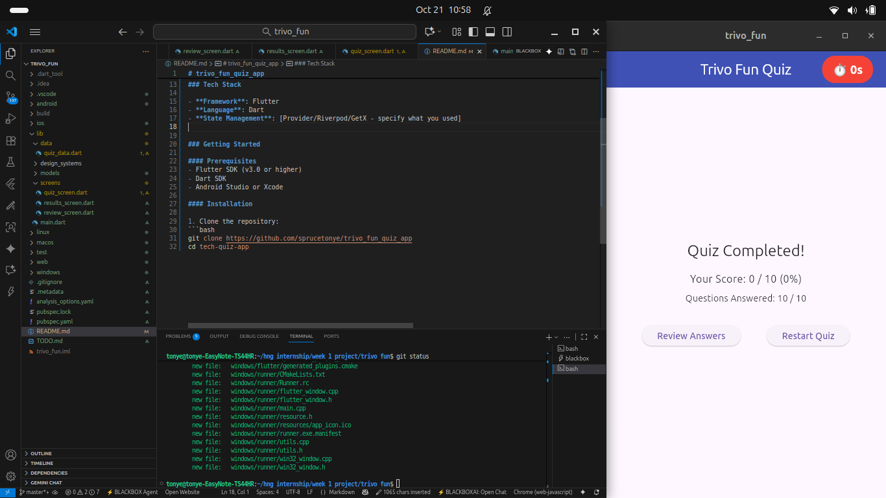
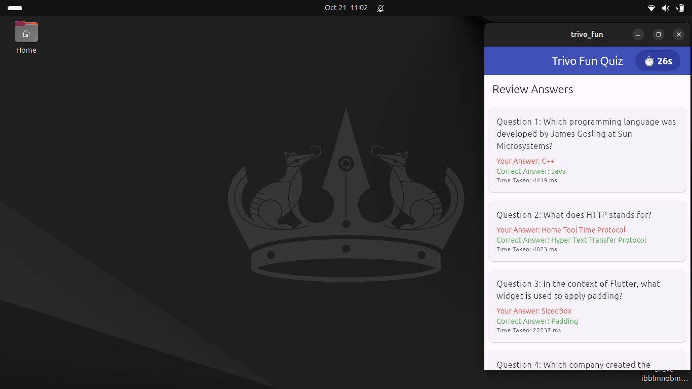

# trivo_fun_quiz_app


Hello I made a Flutter-based quiz application designed for tech enthusiasts to practice and test their knowledge with engaging questions across various technology domains.

### Features

- **Interactive Quiz Interface**: Smooth, user-friendly UI built with Flutter
- **Multiple Question Categories**: Tech topics covering different skill levels
- **Real-time Score Tracking**: Instant feedback on answers
- **Progress Persistence**: Save quiz progress and view history
- **Responsive Design**: Optimized for various screen sizes

### Tech Stack

- **Framework**: Flutter
- **Language**: Dart
- **State Management**: [Provider/Riverpod/GetX - specify what you used]


### Getting Started

#### Prerequisites
- Flutter SDK (v3.0 or higher)
- Dart SDK


#### Installation

#### I walk through on how to install it on your system on your latop

1. Clone the repository:
```bash
git clone https://github.com/sprucetonye/trivo_fun_quiz_app
cd tech-quiz-app


<pre>
<code>
    git clone https://github.com/sprucetonye/trivo_fun_quiz_app

    cd tech-quiz-app

    flutter run

</code>
</pre>

Congratulations

-----------------------------Some Screen Shots----------------------------



